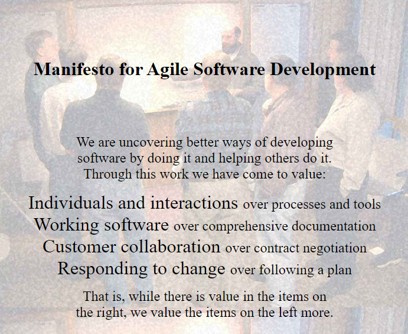
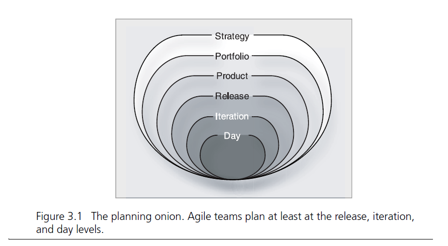
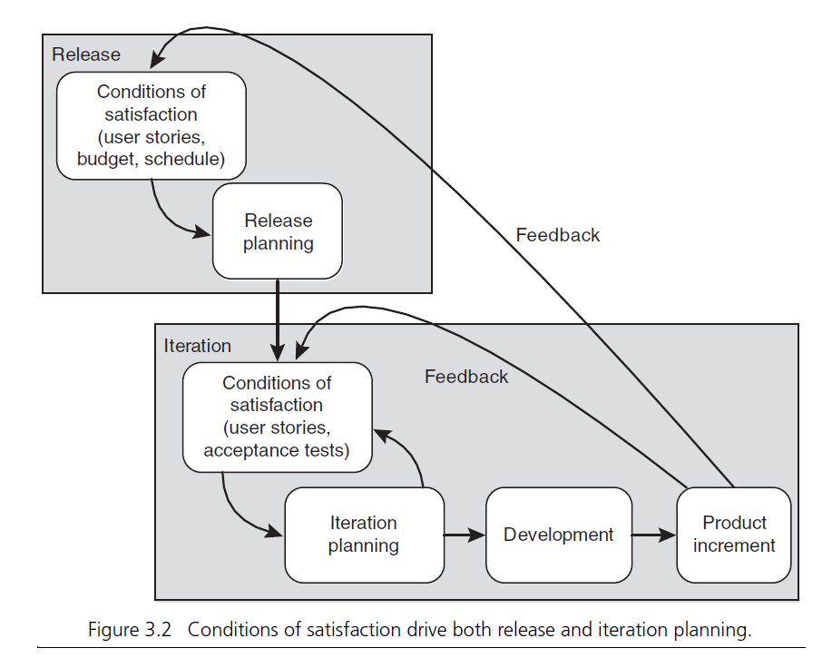
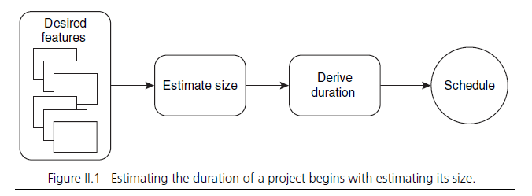
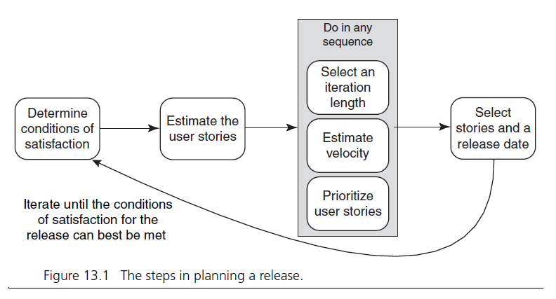

[Buku ](https://www.tokopedia.com/pustakabahtera/agile-estimating-and-planning-buku)Agile Estimation and Planning di tulis oleh [Mike Cohn](https://www.mountaingoatsoftware.com/blog)

*Planning* dan *Plan* merupakan sesuatu yang berbeda. *Yet planning is difficult, plans are often wrong.* Terkadang anggota dalam penerapannya hal ini terbagi menjadi; **(1)** Mereka yang tidak sama sekali melakukan planning sedari awal, atau **(2)** Mereka yang menginvestasikan banyak waktu ke dalam plan mereka, dan mereka menjadi (harus) yakin bahwa plan yang mereka sudah buat harus berjalan dengan benar.

Tulisan diatas di nukil dari beerapa halaman pertama buku Agile Estimation and Planning. Sebelum ssaya berangkat lebih jauh tentang *estimating* dan *planning* mungkin yang layak harus di garis bawahi ada motivasi dan tujuan dibalik membuat estimasi yang baik dalam sebuah project adalah tidak lain untuk membuat estimasi yang telah dibuat tersebut berguna dan bermanfaat untuk project yang akan di jalani. Tentu akan banyak ketidakpastian yang akan erat kaitannya dengan estimasi yang akan dibuat, terutama di awal-awal perencanaan sebuah project. 

Sebuah estimasi akan dikatakan berguna untuk sebuah project ketika an;

* Memberikan *insight* untuk setiap resiko yang terlihat maupun tidak terlihat yang ada di dalam porject.
* Dengan selalu mempelajari setiap hal yang ada di dalam project tersebut, akan dapat mengurangi ketidakpastian yang ada
* Estimasi yang bagus, dapat mengarahkan team untuk membangun kepercayaan yang lebih antar satu sama lain. Dalam hal ini developer dan management.
* Proses estimasi akan mednukung *decision making* dengan menyediakan *insight-insight* kedalam perencaan sebuah project, dalam hal ini terkait biaya/*cost* dan jadwal dari sebuah project.

### Cone of Uncertainty

*Figure on the Book, Agile Estimation and Planning Page 4*

*Figure of Cone of Uncertainty : [Source](http://www.agilenutshell.com/cone_of_uncertainty)*

### The Challenges

Jadi, apa sebenarnya tantangan terbesar yang dihadapi dalam sebuah perencanaan project?

**Perbedaan antara estimasi dan komitmen seringkali kabur dan tidak jelas**. Perbedaan dua konsep tersebut tentu harus dapat di artikan secara jelas pada perencanaan sebuah project. Seringkali juga yang biasa dilakukan **fitur yang dikerjakan tidak di prioritaskan**, dan hanya dikerjakan berdasarkan urutan acak dan suka-suka. Kalau sebuah project dikerjakan seperti ini, jika ada kemungkinan ketelatan dalam sebuah project, maka bisa saja fitur yang akan di buang dari sebuah project adalah fitur yang sudah selesai dikerjakan dan ini akan menjadi sebuah kerugian bagi stakeholder.

Namun juga, ketika proses estimasi sudah hadir dan diterapkan pada sebuah perusahaan, terkadang **ketidakpastian juga seringkali di hiraukan**. Hal ini terjadi boleh jadi ketika estimasi awal pada sebuah project dilakukan dengan salah.

***Planning is often based on completing activites rather than features.*** Jika sebuah planning difokuskan hanya untuk menyelesaikan suatu aktifitas tertentu ini merupakan suatu bias yang dapat menjadi alasan utama dari ketelatan tim dalam menyelesaikan suatu fitur. Hal ini dikarenakan suatu aktifitas pasti memiliki dependensi satu sama lain dan pada akhirnya keterlambatan pun tidak dapat di hindarkan.

Alasan yang lain jika planning suatu fitur hanya berdasarkan penyelesaian dari suatu aktifitas merupakan ide yang buruk adalah [Parkinson Law](https://en.wikipedia.org/wiki/Parkinson%27s_law). Parkison Law merupakan suatu pepatah yang menyatakan 

>  "Work expands so as to fill the time available for its completion"

So, ketika sebuah aktifitas/*task* sudah terlihat tidak akan selesai lebih awal, itu berarti bisa dapat dipastikan fitur tersebut akan selesai terlambat.

Dan tantangan yang berikutnya adalah asumsi bahwa **menempatkan banyak orang pada suatu project dan permasalahan dapat menyelesaikan project atau permasalahan tersebut lebih cepat**. Hal tersebut tentu saja tidak, terdapat 2 masalah dalam hal tersebut, yang pertama adalah ketidak mengertian bahwa software development adalah sebuah problem solving activity yang berarti jika kita menambahkan lebih banyak orang kedalam sebuah problem tersebut, hal ini malah menyebabkan permasalahan akan lebih bertambah, dan permasalahan tersebut tidak akan selesai lebih cepat. Kedua, menambah lebih banyak orang kedalam sebuah team, tentu akan berimbas kepada cara tim berkomunikasi, hal ini tentu dapat meningkatkan kompleksitas komunikasi, yang dapat menyebabkan justru sebuah project justru tidak akan bertambah cepat dalam menuju penyelesaianny.

### Sorting Out The Challenges

Untuk menghadapi tantangan diatas, Mark Cohn dalam Agile Estimation and Planning merangkum beberapa hal fundamental untuk sebuah *agile project* yaitu:

* **Work is done in iterations**
* **Prioritise the feature for a release**
* **Continuesly update the plans**
* **Team should have an "All in This Together" approach**
* **Agile teams should not be larger than 9 people**

### Agile Approach

**Pada buku ini di jelaskan bagaimana cara sebuah kerja tim agile, hal tersebut diantaranya**

* Work as one team
* Work in short iterations
* Deliver something in every iteration
* Focus on business priorities
* Inspect and Adapt

Multiple Level of Planning, a **Planning Onion**

Feedback -- **Conditions of Satisfactions**

**Ringkasan Agile Approach**

Agile team bekerja bersama dalam sebuah team, dengan mengikut sertakan setiap peran yang akan di isi oleh setiap orang yang akan bekerja sama dalam setiap tim tersebut.

Agile team bekerja dalam waktu yang singkat, dalam timeboxed iterations yang akan merelease product setiap kali iterasi. Feature yang dikerjakan dan yang akan dikerjakan dipilih berdasarkan prioritas dari bisnis yang berjalan. Hal ini harus dipastikan bahwa fitur yang paling penting harus dikerjakan lebih dulu. 

Projects dan setiap iterasi dari sebuah agile teams, harus dilihat secara langsung untuk menambah kemampuan dan pengetahuan dari sebuah team, daripada hanya sekedar mengerjakan dan menyelesaikan sebuah project atau setiap fitur yang dikerjakan didalam iterasi tersebut. Project harus menghasilkan 2 jenis pengetahuan, 

1. Pengetahuan tentang product 
2. Pengetahuan tentang project

Kedua hal diatas berguna untuk membuat rencana kedepannya untuk mencapai nilai untuk organisasi.

Agile teams menggunakan 3 level of planning;

1. Release planning -> 3 to 6 months ahead of planning
2. Iteration planning -> 2 to 4 weeks ahead of planning
3. Daily planning -> each day at every standup meeting

### **Estimation**

Yang paling pertama dan harus jelas sedari awal, sebuah estimase tidak bisa disamakan dengan sebuah komitmen. Target dari sebuah estimasi dalam sebuah project agar estimasi tersebut dapat sebisa mungkin berguna dan akurat. Dengan itu hal ini jika kita terlalu over-optimis terhadap sebuah estimasi, ini akan menjadi hal yang kontra produktif bagi sebuah tim.

Sebuah estimasi, tidak dapat berubah kecuali di dalam tim tersebut terdapat perubahan asumsi terkait fitur yang akan dikerjakan, requirement yang berubah, atau dependensi-dependensi yang baru terlihat. Hal ini di hitung harus tidak berdasarkan waktu ataupun sebuah tekanan dari management. Estimasi dalam software engineering akan dilakukan oleh sebuah development team, terimasuk programmer, tester, product owner, yang bertanggung jawab untuk melihat resiko dan sisi lain dari sebuah project atau fitur yang dikerjakan. 

**Story Points**

> In a good shoe, I wear a size six, but a seven feels so good, I buy a size eight

Story points adalah cara mengukur besaran dari sebuah fitur. Singkatnya, dari sebuah user stories, kita ambil satu dan kita diskusikan pada sebuah team berapa story points yang pas berdasrkan effort. Hal ini bisa berdasarkan eksplorasi dari sebuah fitur, development, testing, production pipeline, dan yang lainnya. Cara terbaik untuk melakukan story points sizing adalah menggunakan linear-scale. Story points murni hanya sebuah estimasi dari sebuah besaran sebuah fitur yang akan dikerjakan. Durasi dari sebuah project tidak dapat di estimasi dengan story points. Atau dalam hal ini, story points tidak dapat di konversikan dalam bentuk jam.

**Velocity**

Velocity akan mengukur rate dari sebuah team progress per iterasi. Di akhir dari setiap iterasi sebuah team dapat merefleksikan berapa story points yang dapat di selesaikan, dan dapat mengukur rata-rata story points yang dapat diselesaikan dalam setiap iterasi.

**3 Common Estimation Technique on Estimation**

* Expert Opinion
* Analogy
* Disaggregation

Setiap teknik diatas dapat dilakukan sendiri-sendiri, namun bisa juga dilakukan bersamaan untuk mencapai hasil terbaik dari sebuah estimasi

> If you tell people where to go, but now to tell those people how to get there, you'll be amazed at the results

Why We Should Use Story Points

* Story oints help drive cross-functional behaviour.
* Story-point estimates do not decay
* Story poitns are a pure measeure of size, not time
* Estimating in story points typically faster and more accurate
* My ideal days are not your ideal days

### **Planning**

The difference of uncertainty between Waterfall and Agile. page 83

**Splitting User Stories**

> These days we do not progrm software module by module; we program software feature by feature

Sebagaimana user stories merupakan sesuatu yang penting dan pertama kali dilihat dalam release plan, ini berarti user stories merupakan sesuatu yang akan di implementasikan segera, user stories seringkali harus di pecah bagiannya. Tugas memecah user stories butuh skill dan pengalaman yang cukup untuk melakukannya, namun seperti hal yang lainnya ketika kita sudah sering melakukannya dengan sering, kita akan terbiasa dengan tugas ini. Ada berbagai macam teknik untuk memecah user stories, diantaranya;

1. Split large stories along the boundaries of the data supported by the story; example

   * as a borrower, i wan to pay off my loan. Note : allow overpayments
   * as a borrower, if I accidentally repay too much, I get a refund if it's over $2
2. Split large stories based on the operations that are performed within the story

   * as a coach, I can add new swimmers to my team
   * as a coach, I can edit information about swimmers already on my team
   * as a coach, I can delete swimmers who are no longer on my team
3. Split large stories into separate CRUD operations

   most likely the same with as a coach cases. CRUD is Create Read Update Delete.
4. Consider removing cross-cutting concers (such as security, logging, error handling, and so on) and creating two versions of the story : one with and one without support for the cross-cutting concern.
5. Consider splitting a large story by separating the functional and nonfunctional aspects into separate stories
6. Separate a large story into smaller stories if the smaller stories have different priorities
7. Do not split a story into tasks, instead try to find a way to fire a tracer bullet through the story.

   example : code the user interface, write the middle tier, etc.
8. Avoid making things worse by adding related changes to an appropiately sized feature unless the related changes are of equivalent priority.

Memecah user stories akan sangat berguna apabila satu user story tidak muat dalam satu iterasi.

### Release Plan

Sebuah release plan merupakan high-level plan yang meliputi beberapa iterasi ke depan. Untuk beberapa agile teams, hal ini bisa dalam apa yang akan di release di setiap iterasi dalam 6 bulan kedepan, atau kurang dari itu.

Sebuah release plan tidak harus menggambarkan apa yang akan dikerjakan pada setiap iterasi, level detail yang seperti itu tidak dibutuhkan pada release plan. Merencanakan release plan adalah proses iterasi yang dimulai dengan mengidentifikasi kondisi satisfikasi product owner terhadap project/feature yang dijalankan pada suatu development team. Hal ini biasanya meliputi goals, schedule, scope, dan resources. Ketika release plan sudah dibuat, bukan berarti hal ini akan digantung di dinding dan menjadi acuan dari project yang sedang berjalan, akan tetapi ini harus di update sesuai dengan kondisi team pada setiap iterasi.

**Iteration Planning - Chapter 14**

\--------------------------------------------

### Buy The Book

<https://akmal.page.link/buyAgileEnP> 

### Read the Book

<https://akmal.page.link/agileEnP>